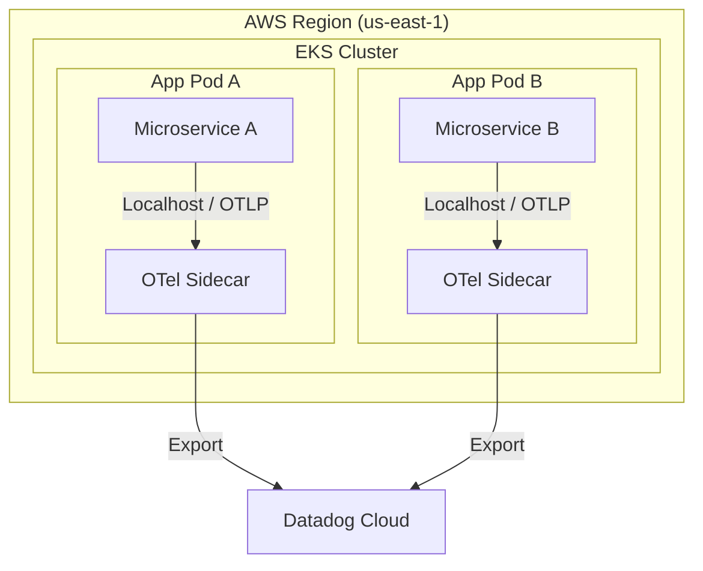
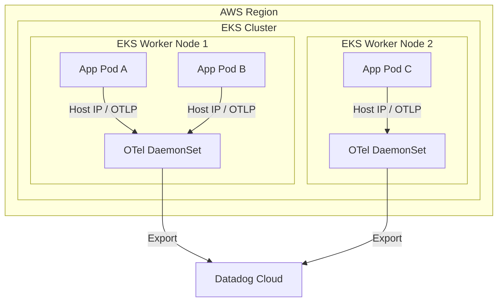
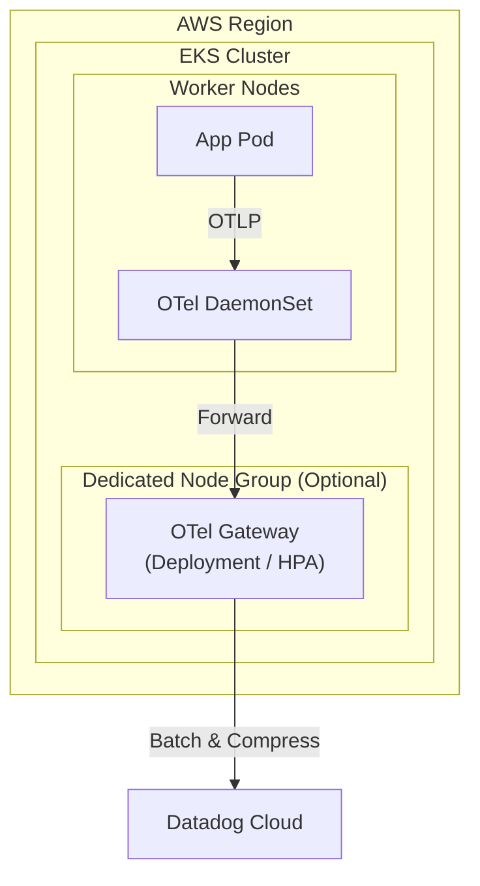
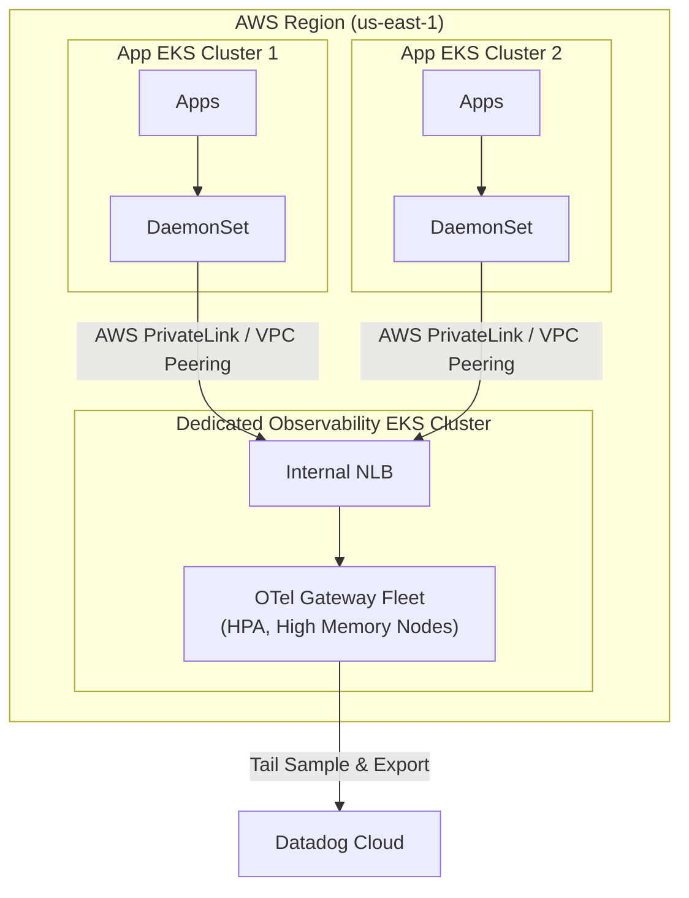
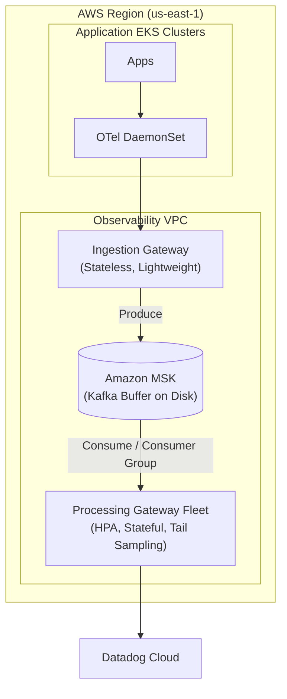

# Global Scale OpenTelemetry Architecture Patterns

For a global enterprise platform, deploying across multiple regions requires an observability architecture that balances resource efficiency, latency, cross-AZ/Region network costs, and telemetry ingestion reliability.

**Important Note on Regions:** All architectural patterns below assume a **Per-Region Deployment**. Cross-region telemetry transfer (e.g., sending EU spans to a US Gateway) is generally avoided due to significant egress costs and high network latency. Each region should have its own isolated pipeline.

Below are four incremental architectural patterns, followed by an "Enterprise Scale" buffer pattern designed specifically to handle high burst traffic.

---

## Pattern 1: Sidecar Only -> Datadog

In this pattern, an OTel Collector runs as a sidecar container inside every single microservice pod. The sidecar collects telemetry and exports it directly to the Datadog backend over the internet.

### 🟩 Pros
* Resource isolation; no intermediate network hops.

### 🟥 Cons
* High baseline cost (1 sidecar per pod); Tail-sampling impossible; Risk of API rate-limiting.

---

## Pattern 2: DaemonSet Only -> Datadog

Instead of a sidecar per pod, one OTel Collector runs on every EKS Worker Node as a DaemonSet. All pods on that node send their telemetry to the node's local agent.

### 🟩 Pros
* Lower overhead (1 agent per node); Enables host-level metrics.

### 🟥 Cons
* Tail-sampling impossible; Traffic spikes crash the node agent, dropping data.

---

## Pattern 3: DaemonSet -> Cluster Gateway -> Datadog

DaemonSets act only as lightweight forwarders, sending data to a centralized OTel Gateway (a Kubernetes Deployment) running within the *same* EKS cluster.

### 🟩 Pros
* Enables cluster-wide tail-sampling; Centralizes API keys; Reduces egress via batching.

### 🟥 Cons
* High memory usage for tail-sampling can starve app pods if running on same nodes.

---

## Pattern 4: DaemonSet -> Dedicated Regional Gateway Cluster -> Datadog

Application clusters run lightweight DaemonSets, which forward data over AWS PrivateLink or VPC Peering to a **Dedicated Observability EKS Cluster** in the same region.

### 🟩 Pros
* Perfect cross-cluster tail-sampling; Isolates heavy telemetry processing from apps.

### 🟥 Cons
* Cross-AZ data transfer costs; Higher operational complexity.

---

## 🌟 Pattern 5: The Enterprise Scale Buffer Architecture

At a global enterprise scale, high traffic events generate massive telemetry spikes. Standard gateways will begin dropping data if the backend experiences an outage or if Gateways hit their memory limits (e.g., a hard limit of processing 20,000 spans at a time to avoid OOM crashes).

To solve this, introduce **Apache Kafka (Amazon MSK)** as a persistent disk buffer between an Ingestion Gateway and a Processing Gateway.

### 🟩 Pros
* Zero data loss during backend outages or massive traffic spikes; Kafka disk acts as a massive buffer preventing Gateway OOM crashes.

### 🟥 Cons
* Highest operational complexity and infrastructure cost.
