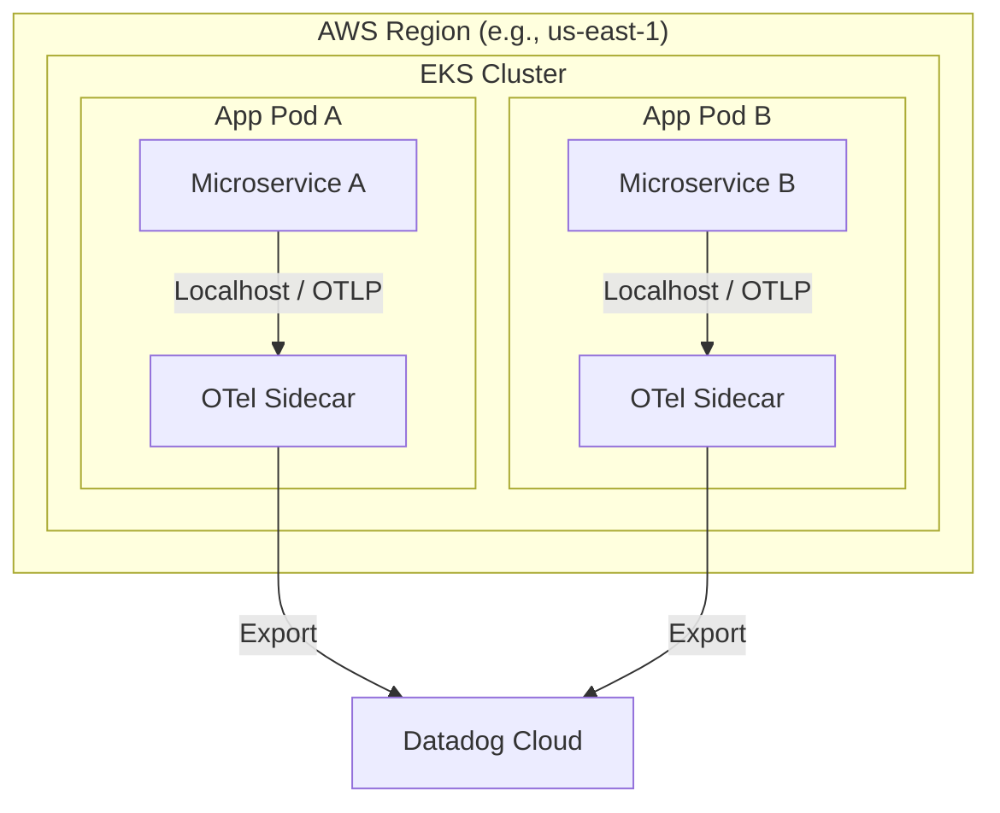
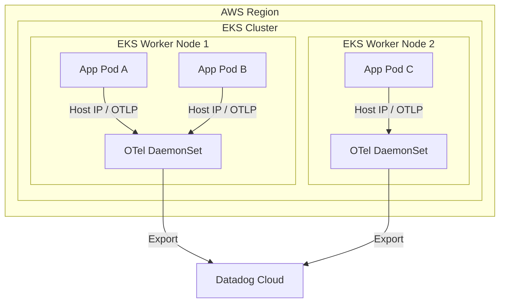
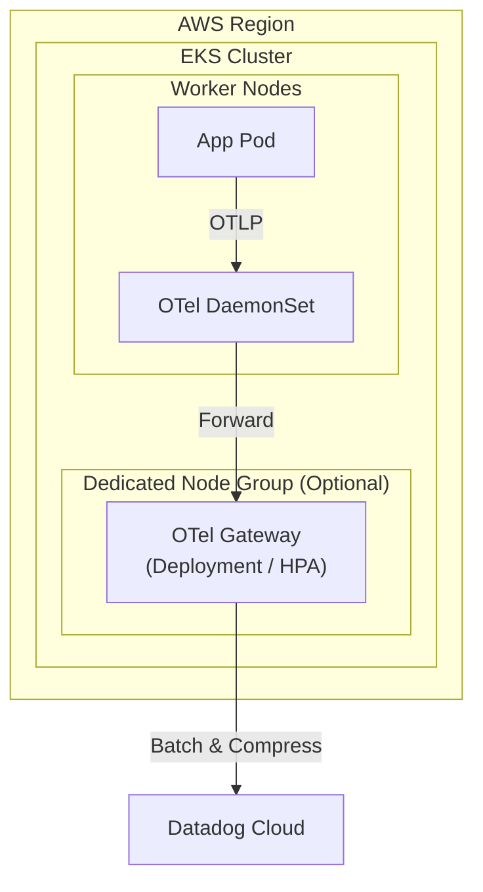
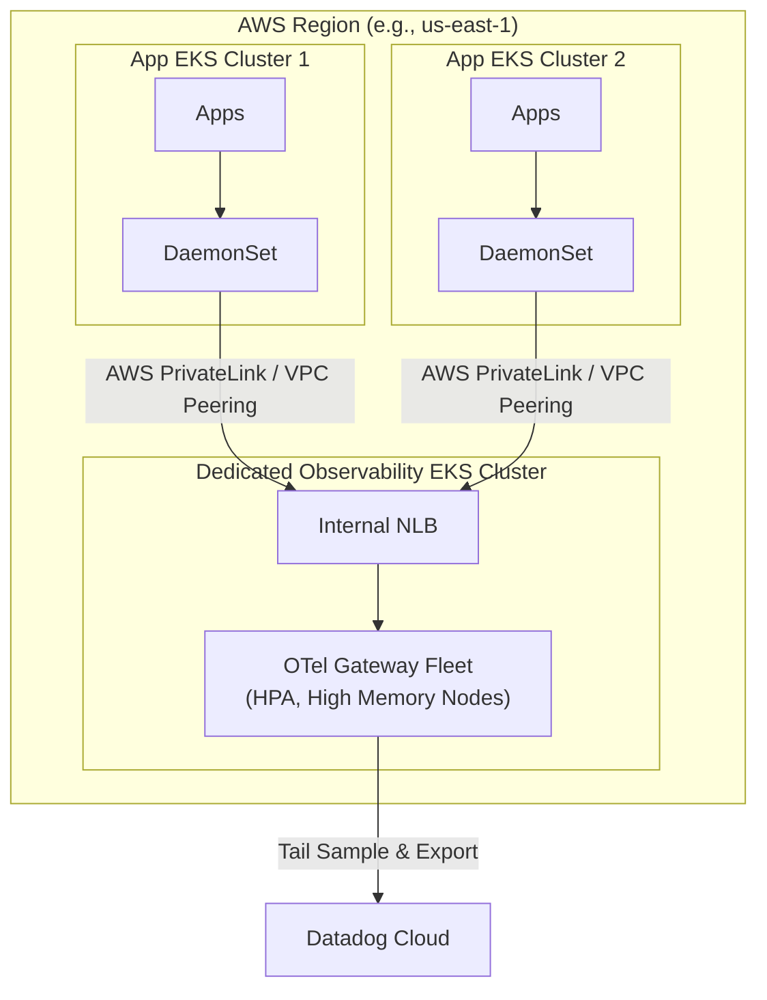
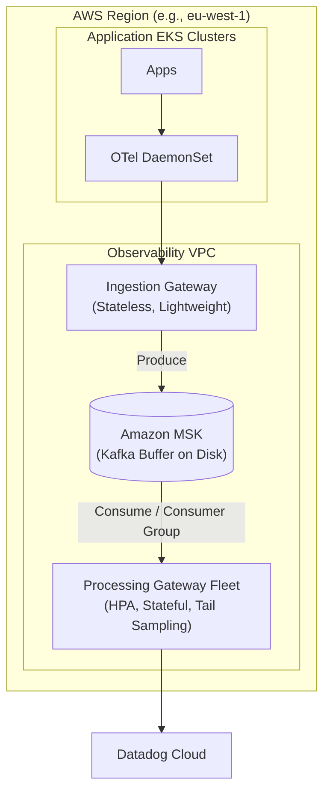

# Global Scale OpenTelemetry Architecture Patterns

For a global enterprise platform, deploying 1000+ microservices across multiple regions requires an observability architecture that balances resource efficiency, latency, cross-AZ/Region network costs, and telemetry ingestion reliability.

**Important Note on Regions:** All architectural patterns below assume a **Per-Region Deployment**. Cross-region telemetry transfer (e.g., sending EU spans to a US Gateway) is generally avoided due to significant egress costs and high network latency. Each region should have its own isolated pipeline.

Below are four incremental architectural patterns, followed by a recommended "Enterprise Scale" pattern (Option 5) designed specifically to handle high burst traffic.

---

## Pattern 1: Sidecar Only -> Datadog

In this pattern, an OTel Collector runs as a sidecar container inside every single microservice pod. The sidecar collects telemetry and exports it directly to the Datadog backend over the internet.

### 🟩 Pros
* Resource consumption is strictly tied to the application pod, avoiding noisy neighbor issues.
* Direct routing to the backend removes intermediate network hops.

### 🟥 Cons
* Paying baseline memory/CPU cost of the collector 1000+ times is highly inefficient at scale.
* Tail-based sampling is impossible because each sidecar only sees its own pod's spans.
* 1000+ pods means 1000+ individual network connections to the backend, leading to connection overload and potential rate limiting.
* Updating the collector configuration requires restarting every application pod.

---

## Pattern 2: DaemonSet Only -> Datadog

Instead of a sidecar per pod, one OTel Collector runs on every EKS Worker Node as a DaemonSet. All pods on that node send their telemetry to the node's local agent.

### 🟩 Pros
* Significantly reduces memory/CPU overhead compared to sidecars by paying baseline cost only per node.
* Easy to mount host volumes to scrape node-level infrastructure metrics like disk IO, CPU, and memory.

### 🟥 Cons
* Tail-based sampling is still impossible as the DaemonSet lacks the full picture of distributed traces spanning multiple nodes.
* API Keys for the backend must be distributed to every node in the cluster.
* Traffic spikes can cause the DaemonSet to OOM and crash, dropping telemetry for all pods on that node.

---

## Pattern 3: DaemonSet -> Cluster Gateway -> Datadog

This is the standard recommended topology for most mid-sized organizations. DaemonSets act only as lightweight forwarders, sending data to a centralized OTel Gateway (a Kubernetes Deployment) running within the *same* EKS cluster.

### 🟩 Pros
* The Gateway sees all traffic within the cluster, enabling intelligent tail-based sampling.
* Centralizes backend API keys in the Gateway.
* Gateway aggressively batches and compresses data, reducing egress costs to the backend.

### 🟥 Cons
* Gateway memory requirements can be extremely high (especially for tail-sampling), potentially starving application nodes if deployed together.
* Gateway only sees traffic for its own cluster, preventing accurate tail-based sampling for transactions crossing multiple EKS clusters.

---

## Pattern 4: DaemonSet -> Dedicated Regional Gateway Cluster -> Datadog

For 1000+ microservices spanning multiple application clusters, we isolate the observability infrastructure. Application clusters run lightweight DaemonSets, which forward data over AWS PrivateLink or VPC Peering to a **Dedicated Observability EKS Cluster** in the same region.

### 🟩 Pros
* Heavy telemetry processing is completely isolated from production application workloads.
* The Regional Gateway sees traffic from all application clusters in that region, enabling perfect cross-cluster tail-based sampling.
* Application clusters are entirely unaffected by Gateway crashes or misconfigurations.
* Allows the Observability cluster to use specialized AWS instances independently of application clusters.

### 🟥 Cons
* Charges apply for cross-AZ data transfer if an App Cluster in AZ-A sends telemetry to the NLB in AZ-B, requiring careful topology-aware routing.
* Requires managing cross-VPC networking and an entirely separate Kubernetes cluster just for observability.

---

## 🌟 Pattern 5: The Enterprise Scale Buffer Architecture (Recommended)

At a global enterprise scale, high traffic events generate massive telemetry spikes. If the backend experiences an outage, or if the Gateways hit their memory limits (e.g., a hard limit of processing 20,000 spans at a time to avoid OOM crashes), standard gateways will begin dropping data. 

To solve this, introduce **Apache Kafka (Amazon MSK)** as a persistent disk buffer between an Ingestion Gateway and a Processing Gateway.

### How this solves the OOM / 20k Span Memory Limit:
In this pattern, the `ProcessGateway` is split into multiple instances (managed by a Horizontal Pod Autoscaler). 
1. If the `ProcessGateway` pods can only hold 20,000 spans in memory without crashing, they simply read from Kafka at a pace they can handle. Excess traffic safely queues up on Kafka's disk (which can hold billions of spans).
2. As consumer lag builds up in Kafka, the HPA spins up more instances of the `ProcessGateway`, and the Kafka Consumer Group automatically balances the partition load across these new gateway instances.
3. If the backend rate-limits your account, the Gateways simply slow their consumption from Kafka, resulting in zero data loss.

### Why this is the ultimate solution:
1. **Separation of Concerns**: The `IngestGateway` is fast, stateless, and auto-scales instantly to write data to Kafka, while the `ProcessGateway` performs heavy CPU/Memory work (tail sampling, scrubbing PII, metric aggregation) at a controlled rate.
2. **Data Forking**: Telemetry can easily be sent to multiple backends simultaneously (e.g. Datadog for alerting, and an AWS S3 Data Lake for cheap long-term storage) by attaching another consumer to the Kafka topic.
