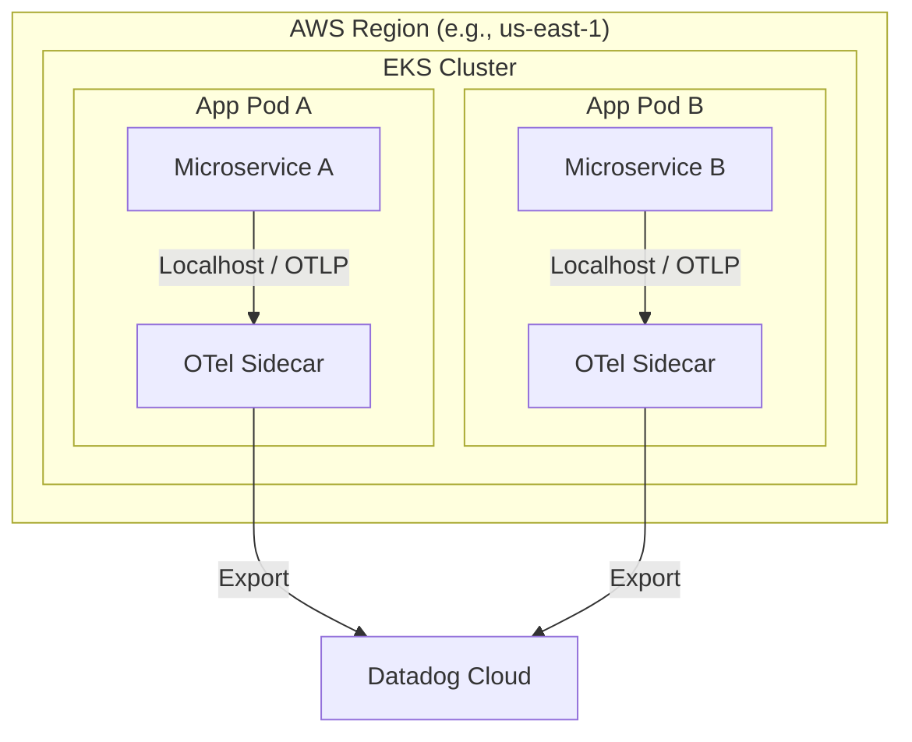
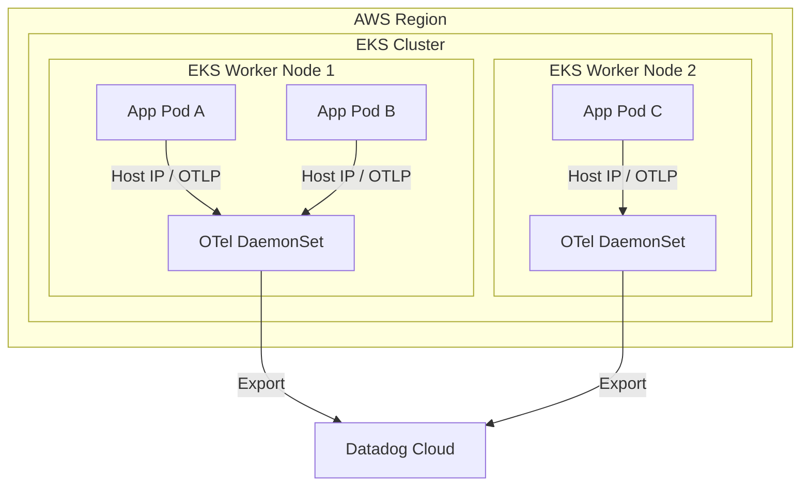
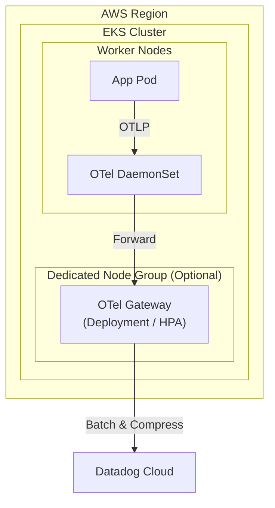
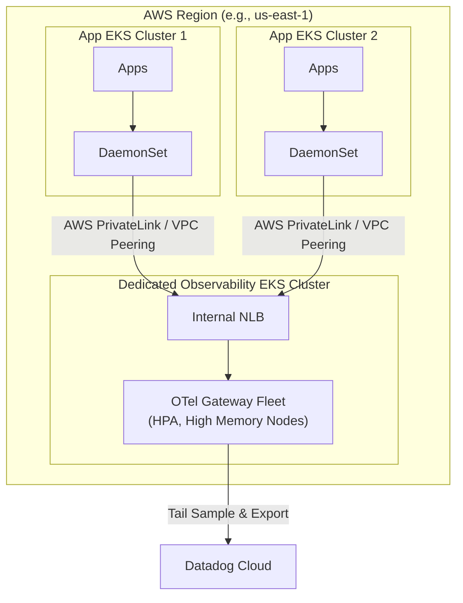
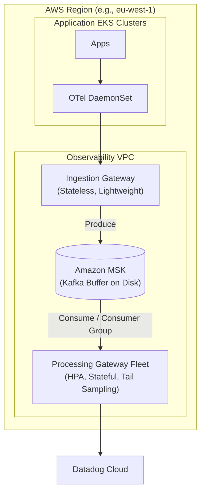

# Global Scale OpenTelemetry Architecture Patterns

For a global platform like Playstation, deploying 1000+ microservices across the US, EU, and Australia requires an observability architecture that balances resource efficiency, latency, cross-AZ/Region network costs, and telemetry ingestion reliability.

**Important Note on Regions:** All architectural patterns below assume a **Per-Region Deployment**. Cross-region telemetry transfer (e.g., sending EU spans to a US Gateway) is generally avoided due to significant egress costs and high network latency. Each region should have its own isolated pipeline.

Below are four incremental architectural patterns, followed by a recommended "Enterprise Scale" pattern (Option 5) designed specifically to handle high burst traffic (e.g., game launch days).

---

## Pattern 1: Sidecar Only -> Datadog

In this pattern, an OTel Collector runs as a sidecar container inside every single microservice pod. The sidecar collects telemetry and exports it directly to the Datadog backend over the internet.

### 🟩 Pros
* **Strict Isolation**: Resource consumption (CPU/Memory) of the collector is strictly tied to the application pod it serves. No "noisy neighbor" issues.
* **Simple Routing**: Telemetry goes straight to the backend without any intermediate hops.

### 🟥 Cons
* **Massive Overhead**: Running 1000+ sidecars means paying the baseline memory/CPU cost of the collector 1000+ times. This is highly inefficient.
* **No Tail-Based Sampling**: Tail-based sampling requires looking at the *entire* trace across multiple services. Since each sidecar only sees its own pod's spans, tail sampling is impossible.
* **Connection Overload**: 1000+ pods means 1000+ individual network connections to Datadog, which can lead to rate limiting.
* **Configuration Management**: Updating the collector configuration requires restarting every application pod.

---

## Pattern 2: DaemonSet Only -> Datadog

Instead of a sidecar per pod, one OTel Collector runs on every EKS Worker Node as a DaemonSet. All pods on that node send their telemetry to the node's local agent.

### 🟩 Pros
* **Resource Efficiency**: Significant reduction in memory/CPU overhead compared to sidecars. You only pay the baseline cost per node, not per pod.
* **Host Metrics**: DaemonSets can easily mount host volumes to scrape valuable node-level infrastructure metrics (disk IO, CPU, memory).

### 🟥 Cons
* **Still No Tail-Based Sampling**: A DaemonSet only sees spans for pods running on its specific node. It lacks the full picture of a distributed trace spanning multiple nodes.
* **Secret Sprawl**: API Keys for Datadog must be distributed to every node in the cluster.
* **Traffic Spikes**: If a node gets hit with a massive spike in traffic, the DaemonSet might OOM (Out of Memory) and crash, dropping telemetry for all pods on that node.

---

## Pattern 3: DaemonSet -> Cluster Gateway -> Datadog

This is the standard recommended topology for most mid-sized organizations. DaemonSets act only as lightweight forwarders, sending data to a centralized OTel Gateway (a Kubernetes Deployment) running within the *same* EKS cluster.

### 🟩 Pros
* **Enables Tail-Based Sampling**: The Gateway sees *all* traffic within the cluster, allowing it to intelligently sample traces (e.g., keep 100% of errors, but only 5% of successful requests).
* **Centralized Secrets**: Only the Gateway needs the Datadog API keys.
* **Batching & Compression**: The Gateway can aggressively batch and compress data, reducing egress costs to Datadog.

### 🟥 Cons
* **Resource Contention**: The Gateway can be extremely memory-intensive (especially when holding traces in memory for tail-sampling). If deployed on the same nodes as your apps, it can cause resource starvation.
* **Limited Scope**: The Gateway only sees traffic for *one* cluster. If a transaction crosses two different EKS clusters, the Gateway cannot perform accurate tail-based sampling.

---

## Pattern 4: DaemonSet -> Dedicated Regional Gateway Cluster -> Datadog

For 1000+ microservices spanning multiple application clusters, we isolate the observability infrastructure. Application clusters run lightweight DaemonSets, which forward data over AWS PrivateLink or VPC Peering to a **Dedicated Observability EKS Cluster** in the same region.

### 🟩 Pros
* **Zero Contention**: Heavy telemetry processing is completely isolated from production application workloads.
* **Cross-Cluster Tail Sampling**: The Regional Gateway sees traffic from *all* application clusters in that region, allowing for perfect tail-based sampling even if a transaction hops between clusters.
* **Blast Radius**: If a bad configuration crashes the Gateway, application clusters are entirely unaffected.
* **Scale**: The Observability cluster can use specialized AWS instances (e.g., memory-optimized R6g instances) independent of the application clusters.

### 🟥 Cons
* **Cross-AZ Egress Costs**: If an App Cluster in AZ-A sends telemetry to the NLB in AZ-B, AWS charges for cross-AZ data transfer. Careful topology-aware routing is required.
* **Operational Complexity**: Requires managing cross-VPC networking and an entirely separate Kubernetes cluster just for observability.

---

## 🌟 Pattern 5: The "Playstation Scale" Buffer Architecture (Recommended)

At a global scale (Playstation), game launches or holiday events generate **massive traffic spikes**. If Datadog experiences an outage, or if the memory limits of your Gateways are reached (e.g., a hard memory limit of processing 20,000 spans at a time to avoid OOM crashes), standard gateways will begin dropping data. 

To solve this, introduce **Apache Kafka (Amazon MSK)** as a persistent disk buffer between an Ingestion Gateway and a Processing Gateway.

### How this solves the OOM / 20k Span Memory Limit:
In this pattern, the `ProcessGateway` is split into multiple instances (managed by a Horizontal Pod Autoscaler). 
1. **Disk Buffering**: If the `ProcessGateway` pods can only hold 20,000 spans in memory without crashing, they simply read from Kafka at a pace they can handle. Any excess traffic during a spike safely queues up on Kafka's disk (which can hold billions of spans).
2. **Horizontal Scaling**: As consumer lag builds up in Kafka, the HPA spins up *more* instances of the `ProcessGateway`. The Kafka Consumer Group automatically balances the partition load across these new gateway instances.
3. **Resilience**: If Datadog rate-limits your account, the Gateways simply slow their consumption from Kafka. **Zero data loss.**

### Why this is the ultimate solution:
1. **Separation of Concerns**: 
    * `IngestGateway`: Extremely fast, stateless, auto-scales instantly. Its only job is to get data off the application nodes as fast as possible and write it to Kafka.
    * `ProcessGateway`: Can take its time doing heavy CPU/Memory work (tail sampling, scrubbing PII, metric aggregation) reading from Kafka at a controlled rate.
2. **Data Forking**: Want to send traces to Datadog, but archive everything to an AWS S3 Data Lake for cheap long-term storage? Just attach another consumer to the Kafka topic.
