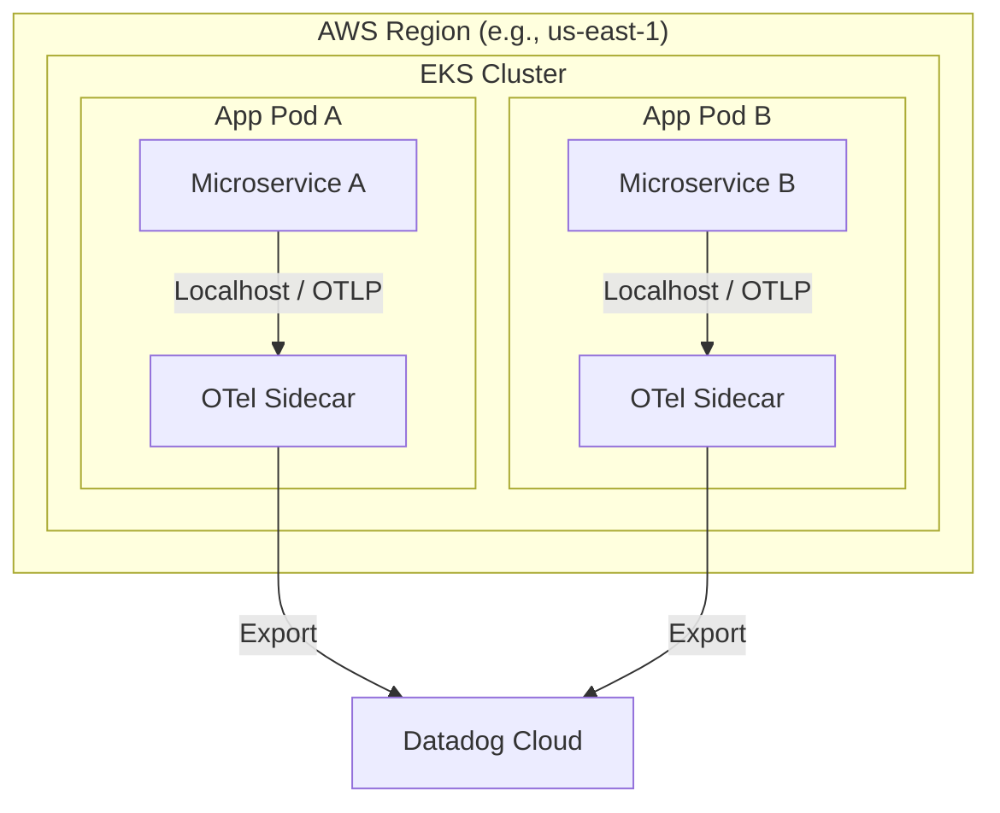
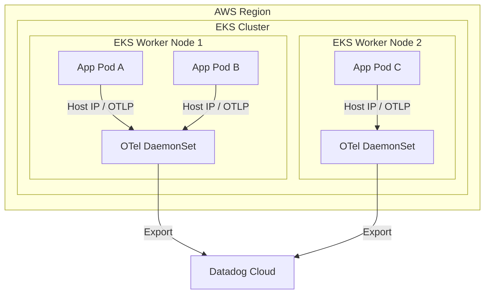
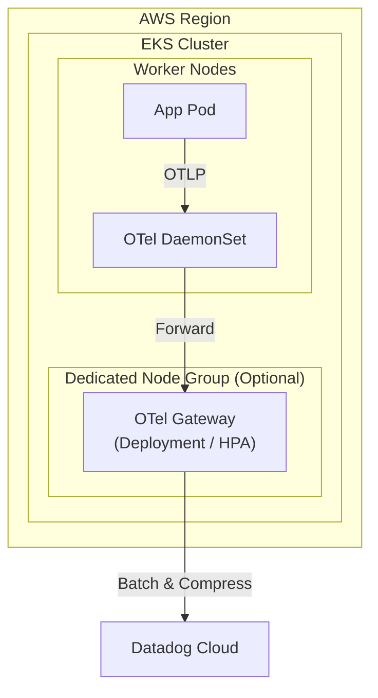
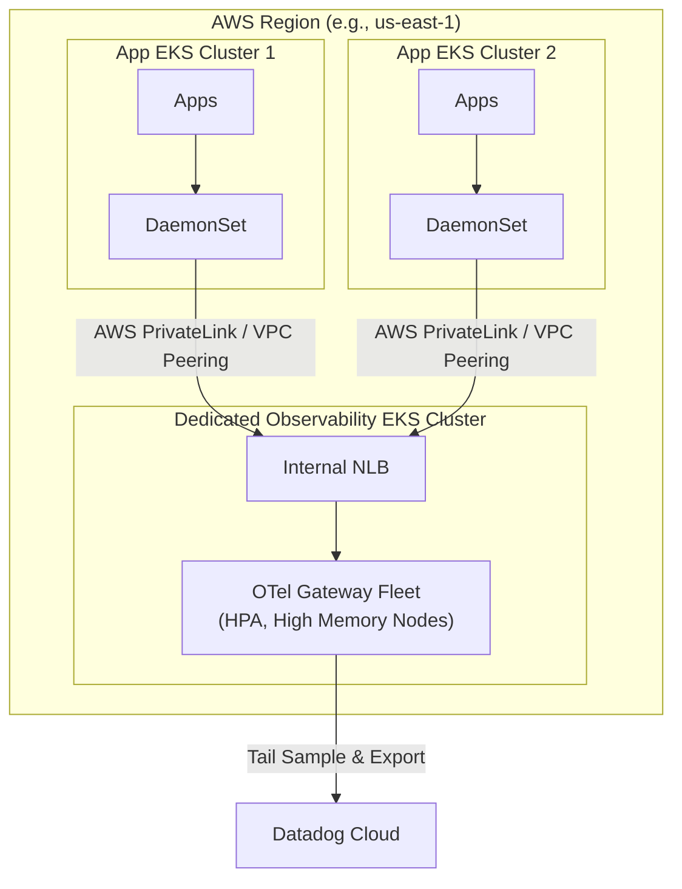
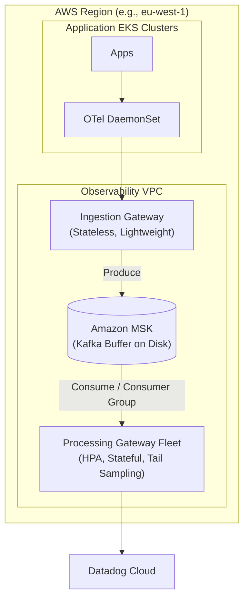

# Global Scale OpenTelemetry Architecture Patterns

For a global enterprise platform, deploying across multiple regions requires an observability architecture that balances resource efficiency, latency, cross-AZ/Region network costs, and telemetry ingestion reliability.

**Important Note on Regions:** All architectural patterns below assume a **Per-Region Deployment**. Cross-region telemetry transfer (e.g., sending EU spans to a US Gateway) is generally avoided due to significant egress costs and high network latency. Each region should have its own isolated pipeline.

Below are four incremental architectural patterns, followed by an "Enterprise Scale" buffer pattern designed specifically to handle high burst traffic.

---

## Pattern 1: Sidecar Only -> Datadog

In this pattern, an OTel Collector runs as a sidecar container inside every single microservice pod. The sidecar collects telemetry and exports it directly to the Datadog backend over the internet.

### 🟩 Pros
* Resource consumption is strictly tied to the application pod, avoiding noisy neighbor issues.
* Direct routing to the backend removes intermediate network hops.

### 🟥 Cons
* Highly inefficient at scale due to paying the collector's baseline memory/CPU cost per pod.
* Tail-based sampling is impossible because each sidecar only sees its own pod's spans.
* High risk of connection overload and rate limiting due to thousands of individual network connections.
* Updating collector configurations requires restarting every application pod.

---

## Pattern 2: DaemonSet Only -> Datadog

Instead of a sidecar per pod, one OTel Collector runs on every EKS Worker Node as a DaemonSet. All pods on that node send their telemetry to the node's local agent.

### 🟩 Pros
* Memory/CPU resource quota needed only per node, significantly reducing total overhead compared to sidecars.
* Enables easy scraping of node-level infrastructure metrics via host volume mounts.

### 🟥 Cons
* Tail-based sampling remains impossible as the DaemonSet only sees spans for its specific node.
* Traffic spikes can cause the DaemonSet to OOM and crash, dropping telemetry for all pods on that node.

---

## Pattern 3: DaemonSet -> Cluster Gateway -> Datadog

DaemonSets act only as lightweight forwarders, sending data to a centralized OTel Gateway (a Kubernetes Deployment) running within the *same* EKS cluster.

### 🟩 Pros
* Enables intelligent tail-based sampling since the Gateway sees all traffic within the cluster.
* Centralizes backend API keys in the Gateway.
* Aggressive batching and compression reduce egress costs to the backend.

### 🟥 Cons
* High memory requirements for tail-sampling can starve application nodes if deployed on the same instances.
* Tail-based sampling is inaccurate for transactions that cross multiple EKS clusters, as the Gateway only sees local cluster traffic.

---

## Pattern 4: DaemonSet -> Dedicated Regional Gateway Cluster -> Datadog

Application clusters run lightweight DaemonSets, which forward data over AWS PrivateLink or VPC Peering to a **Dedicated Observability EKS Cluster** in the same region.

### 🟩 Pros
* Completely isolates heavy telemetry processing from production application workloads.
* Enables perfect cross-cluster tail-based sampling by centralizing all regional traffic.
* Protects application clusters from being affected by Gateway crashes or misconfigurations.
* Allows the Observability cluster to use specialized AWS instances independently.

### 🟥 Cons
* Incurs cross-AZ data transfer charges, requiring careful topology-aware routing.
* Increases operational complexity by requiring cross-VPC networking and a separate Kubernetes cluster.

---

## 🌟 Pattern 5: The Enterprise Scale Buffer Architecture

At a global enterprise scale, high traffic events generate massive telemetry spikes. Standard gateways will begin dropping data if the backend experiences an outage or if Gateways hit their memory limits (e.g., a hard limit of processing 20,000 spans at a time to avoid OOM crashes).

To solve this, introduce **Apache Kafka (Amazon MSK)** as a persistent disk buffer between an Ingestion Gateway and a Processing Gateway.

### How this solves the OOM / 20k Span Memory Limit:
In this pattern, the `ProcessGateway` is split into multiple instances (managed by a Horizontal Pod Autoscaler). 
1. If the `ProcessGateway` pods can only hold 20,000 spans in memory without crashing, they simply read from Kafka at a pace they can handle. Excess traffic safely queues up on Kafka's disk (which can hold billions of spans).
2. As consumer lag builds up in Kafka, the HPA spins up more instances of the `ProcessGateway`, and the Kafka Consumer Group automatically balances the partition load across these new gateway instances.
3. If the backend rate-limits your account, the Gateways simply slow their consumption from Kafka, resulting in zero data loss.

### Why this architecture is highly resilient:
1. **Separation of Concerns**: The `IngestGateway` is fast, stateless, and auto-scales instantly to write data to Kafka. The `ProcessGateway` performs heavy CPU/Memory work (tail sampling, scrubbing PII, metric aggregation) at a controlled rate.
2. **Data Forking**: Telemetry can easily be sent to multiple backends simultaneously (e.g. Datadog for alerting, and an AWS S3 Data Lake for cheap long-term storage) by attaching another consumer to the Kafka topic.
