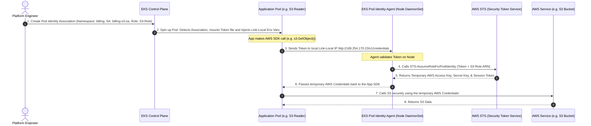

# Amazon EKS Pod Identity: Configuration & Token Exchange Flow

This document clarifies how EKS Pod Identity maps Kubernetes namespaces and ServiceAccounts to AWS IAM Roles, and visualizes the underlying token exchange sequence.

---

## 1. How to grant S3 access to a new application (S3 Scenario)

If you have a new application in a different namespace (e.g., `billing`) that needs access to an S3 bucket, simply declaring the `serviceAccountName` in your deployment is **not enough**. 

You must configure the binding on both the Kubernetes side and the AWS IAM side.

### The 3-Step Configuration:

1. **Step 1 (AWS IAM Role)**: 
   Create an IAM Role with an S3 Read policy. The trust policy of this role must trust the EKS Pod Identity service principal:
   ```json
   {
     "Version": "2012-10-17",
     "Statement": [{
       "Effect": "Allow",
       "Principal": { "Service": "pods.eks.amazonaws.com" },
       "Action": ["sts:AssumeRole", "sts:TagSession"]
     }]
   }
   ```
2. **Step 2 (Kubernetes ServiceAccount)**:
   Create a standard `ServiceAccount` manifest in Kubernetes inside your namespace, and assign it to your pod:
   ```yaml
   apiVersion: v1
   kind: ServiceAccount
   metadata:
     name: billing-s3-sa
     namespace: billing
   ```
3. **Step 3 (EKS Pod Identity Association)**:
   You create the association in Terraform to link them together:
   ```hcl
   resource "aws_eks_pod_identity_association" "billing_s3" {
     cluster_name    = "my-eks-cluster"
     namespace       = "billing"           # The target namespace
     service_account = "billing-s3-sa"      # The target Kubernetes ServiceAccount
     role_arn        = aws_iam_role.s3_role.arn # The target AWS IAM Role
   }
   ```

If you don't create **Step 3**, EKS will treat the pod's service account as a plain Kubernetes service account with zero AWS privileges.

---

## 2. EKS Pod Identity Token Exchange Flow

Here is the step-by-step sequence diagram showing how the EKS control plane, your pod, the node agent, and AWS STS interact to fetch temporary credentials:



---

## 🔍 Why this is secure:
1. **Link-Local Privacy**: Because `169.254.170.23` is a Link-Local address, the authentication traffic **never leaves the physical EKS node**. It cannot be sniffed or intercepted from outside the EC2 host.
2. **Short-Lived Keys**: The credentials returned in Step 5 are only valid for **15 minutes to 1 hour**. The SDK automatically contacts the local agent to refresh them before they expire.
