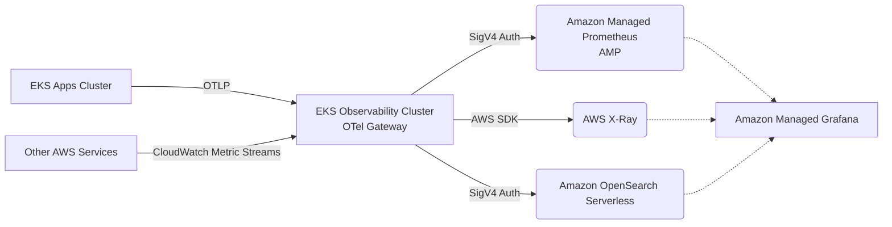
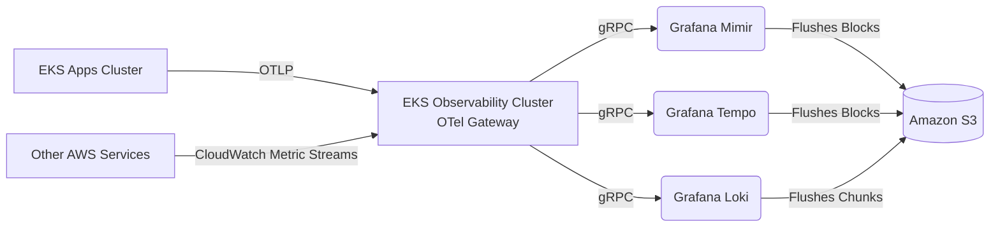
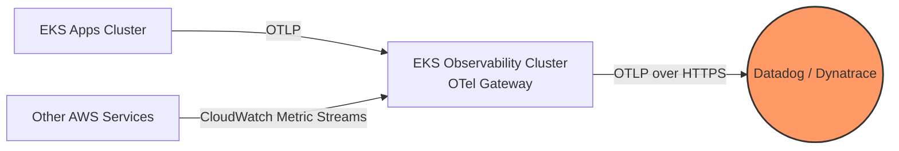

# Observability as a Product (OaaP) Platform

Treating observability as an internal product with zero-friction onboarding for developers.

## 🏛️ The Four Pillars

1. **[Dashboard & Alert Generators (GitOps)](file:///Users/karthik.orugonda/github/eks-otel-observability-sandbox/observability-platform/dashboard-and-alert-generators/README.md)**  
   Developers define alerts via a `values.yaml` Helm chart. Generates `PrometheusRule` & `GrafanaDashboard` CRDs automatically. Scales better than centralized Terraform.
   
2. **[Golden Signals Templates](file:///Users/karthik.orugonda/github/eks-otel-observability-sandbox/observability-platform/golden-signals/README.md)**  
   Unified Dashboards (Metrics, Logs, Traces) for core health (Latency, Traffic, Errors, Saturation).  
   * [Go Service Dashboard](file:///Users/karthik.orugonda/github/eks-otel-observability-sandbox/observability-platform/golden-signals/go-service-dashboard.json) | [Python Service Dashboard](file:///Users/karthik.orugonda/github/eks-otel-observability-sandbox/observability-platform/golden-signals/python-service-dashboard.json)

3. **[Multi-Tenancy & Dynamic Routing](file:///Users/karthik.orugonda/github/eks-otel-observability-sandbox/observability-platform/routing-and-multitenancy/otel-gateway-multitenant.yaml)**  
   Routes Traces, Metrics, and Logs to isolated backend clusters based on the `tenant.id` attribute.

4. **[Telemetry Budgeting](file:///Users/karthik.orugonda/github/eks-otel-observability-sandbox/observability-platform/telemetry-budgeting/otel-gateway-tail-sampling.yaml)**  
   Cost control via Gateway tail-sampling: 100% of errors/slow requests retained, but only 5% of healthy traffic. Includes tenant rate-limiting.

---

## 💾 AWS Storage Architecture Comparisons

All architectures below use **Pattern 4** (Dedicated Regional Gateway Cluster). 

### A: AWS Managed

* **🟩 Pros**: Zero TSDB operations. Highly available.
* **🟥 Cons**: High volume OpenSearch is expensive. X-Ray search is limited.

### B: Self-Hosted LGTM

* **🟩 Pros**: Extremely low cost. 99.999999999% S3 durability.
* **🟥 Cons**: Requires managing compactor workers and stateful sets.

### C: Commercial SaaS

* **🟩 Pros**: Zero infra management. Native AIOps.
* **🟥 Cons**: Very expensive at scale without aggressive telemetry budgeting.
