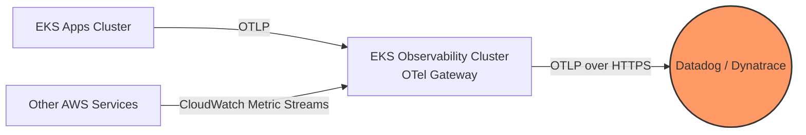
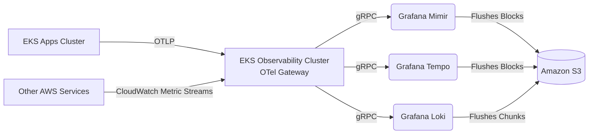
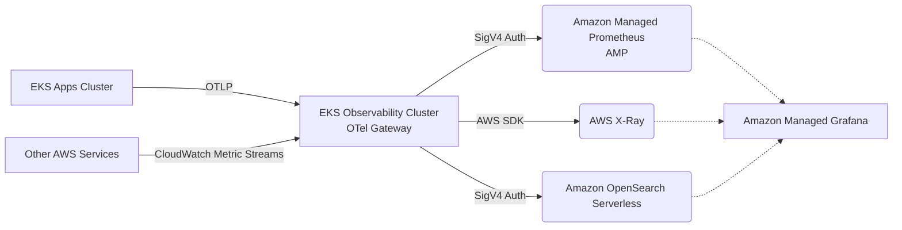

# Observability as a Product (OaaP) Platform

Treating observability as an internal product with zero-friction onboarding for developers.

## 🚀 Platform Capabilities

* **[GitOps Alerting & Dashboards](file:///Users/karthik.orugonda/github/eks-otel-observability-sandbox/observability-platform/dashboard-and-alert-generators/README.md)**: Developers define alerts via simple Helm `values.yaml` which auto-generates Prometheus/Grafana CRDs.
* **[Golden Signals Templates](file:///Users/karthik.orugonda/github/eks-otel-observability-sandbox/observability-platform/golden-signals/README.md)**: Standardized health dashboards (Latency, Traffic, Errors, Saturation) for [Go](file:///Users/karthik.orugonda/github/eks-otel-observability-sandbox/observability-platform/golden-signals/go-service-dashboard.json) and [Python](file:///Users/karthik.orugonda/github/eks-otel-observability-sandbox/observability-platform/golden-signals/python-service-dashboard.json).
* **[Cost Control & Multi-Tenancy](file:///Users/karthik.orugonda/github/eks-otel-observability-sandbox/observability-platform/routing-and-multitenancy/otel-gateway-multitenant.yaml)**: Gateway-level tail-sampling (retain 100% of errors, 5% of healthy traffic) and tenant-based routing.

---

## 💾 AWS Storage Architecture Comparisons

All architectures below use **Pattern 4** (Dedicated Regional Gateway Cluster). 

### A: Commercial SaaS (Datadog / Dynatrace)

* **🟩 Pros**: Zero infra management. Native AIOps.
* **🟥 Cons**: Very expensive at scale without aggressive telemetry budgeting.

### B: Self-Hosted LGTM (Mimir, Tempo, Loki)

* **🟩 Pros**: Extremely low cost. 99.999999999% S3 durability.
* **🟥 Cons**: Requires managing compactor workers and stateful sets.

### C: AWS Managed (AMP, X-Ray, OpenSearch)

* **🟩 Pros**: Zero TSDB operations. Highly available.
* **🟥 Cons**: High volume OpenSearch is expensive. X-Ray search is limited.
